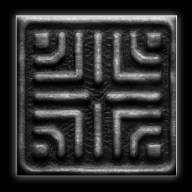

<h1 align="center">CyOracle Tarot v.1</h1>

CyOracle Tarot is the premier Tarot deck of Digital Serendipity and Transhuman Wisdom.

## Summary

The CyOracle Tarot deck combines ancient and modern symbolism to offer insight and guidance for navigating the digital age. Each card uses symbols from recent technological products to correspond to traditional Tarot symbols, creating a unique blend of ancient and futuristic imagery. Despite the use of modern technology-related symbols, the cards themselves have an ancient and eternal appearance, adding a sense of timelessness to the deck. CyOracle can encourage us to question our assumptions and perceptions, and to consider the impact of technology on our lives and society as a whole. 

## Functionality

Right now, the CyOracle website accepts a question as a input (or any string that ends with a ?) and returns a random one of 78 cards along with its corresponding fortune.

## Roadmap

-This will be linked to a NFT project  
-Add functionality to choose multiple cards and generate a reading based on the combination of meanings
